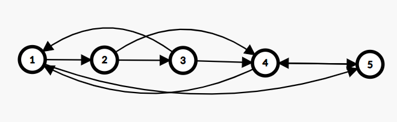
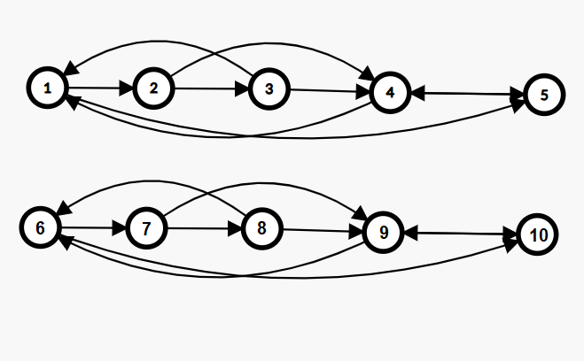

### Задача 1. Премахване на дублиращи се елементи от произволен двусвързан списък

Дадена е главата на двусвързан свързан списък. Изтрийте всички дублиращи се елементи, така че всяка стойност да се появява само веднъж. Върнете главата към променения списък. 

Пример:

```
Вход:
1 <-> 2 <-> 3 <-> 2 <-> 4

Изход:
1 <-> 2 <-> 3 <-> 4
```

---

### Задача 2. Размяна на огледални елементи на позиция К

Напишете програма, която получава главата на двусвързан списъка и индекс `К`. В новият списък елемента на позиция `К` броейки от ляво надясно и позиция `К` от дясно наляво са разменени.

Върнете главата на променения свързан списък.

> **Забележка:** 
> Индексацията на списъка започва от 1

Пример:

```
Вход:
head 2 // head - указател към началото | k=2
 |
 V
 5 <-> 2 <-> 15 <-> 30 <-> 4

Изход:
 5 <-> 30 <-> 15 <-> 2 <-> 4
 ^
 |
result
```

Пример:

```
Вход:
head 1 // head - указател към началото | k=1
 |
 V
 5 <-> 2 <-> 15 <-> 30 <-> 4

Изход:
 4 <-> 2 <-> 15 <-> 30 <-> 5
 ^
 |
result
```

*Упътване: напишете си функция за размяна на два възела, която получава указатели към тях*

---

### Задача 3. Сортиране на почти сортиран двусвързан списък

Дадена ви е глава на двусвързан списък съдържащ цели числа и число `K`. Ще наричаме списъка `почти сортиран` с отместване `К`, когато всеки възел се намира на най-много `K` позиции встрани от правилната си позиция. Да се сортира почти сортираният списък и да се върне новото начало на списъка.

Пример:
```
Вход:

head 2 // head - указател 
към началото | K=2
 |
 V
 2 <-> 5 <-> 15 <-> 3 <-> 4


Изход:
 2 <-> 3 <-> 4 <-> 5 <-> 15
 ^
 |
result
```

*Упътване: можете да използвате функцията за размяна, която сте написали по-горе*

---
 
### Задача 4. Копиране на списък със случайни указатели

Даден ви е списък, където във всеки възел имаме два указателя: един към следващия елемент и един към случаен елемент от същия списък. Напишете програма, която създава нов списък, копие на първия, като запазва случайните указатели. **Новият списък не трябва да споделя памет с първия.**  


**Допълнение: Помислете как да напишете задачата за линейно време**
*Упътване: Можете да направите копие на всеки елемент непосредствено след него и после да възстановите указателите.*

**Пример:**
**Вход:**


**Резултат:**

