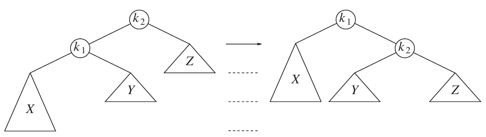
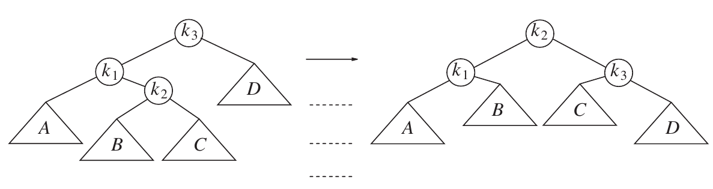

# СДП Семинар 10 -- Балансирани дървета

## AVL дърво

- Adelson-Velsky и Landis -- Двама съветски учени, които публикуват идеята за самобалансиране през 1962 г.
- Балансиращ фактор: bf(v) = height(right) - height(left)
- Имаме четири случая на дисбаланс при някой възел:
  - дясното му поддърво е по-тежко и дясното поддърво на десния наследник е по-високо -> използваме лява ротация;
  - лявото му поддърво е по-тежко и лявото поддърво на левия наследник е по-високо -> използваме дясна ротация;
  - дясното му поддърво е по-тежко и лявото поддръво на десния наследник е по-високо -> използваме дясна-лява ротация;
  - лявото му поддърво е по-тежко и дясното поддърво на левия наследник е по-високо -> използваме лява-дясна ротация.

[Хубава визуализация на процесите по добавяне и премахване, включително ротации](https://www.cs.usfca.edu/~galles/visualization/AVLtree.html)

### Видове ротации

#### Лява ротация


#### Дясна ротация



#### Дясна-лява ротация


#### Лява-дясна ротация



## Други видове самобалансиращи се дървета

### Черно-червено дърво

- С по-лек критерий за балансираност -> ползва се по-често от AVL дърво поради тази причина;
- Използва оцветяване на върховете -- червени или черни, вместо височината, като има строги правила за подредбата на цветовете;
- Използва се във вградените структури от стандартната библиотека [`std::set`](https://en.cppreference.com/w/cpp/container/set) и [`std::map`](https://en.cppreference.com/w/cpp/container/map).


### B-дърво

- По-общ вариант на двоичните дървета за търсене -- един възел може да има повече от 2 наследника;
- Използват се във файловите системи и базите данни.

## Задача за упражнение на дървета (за вкъщи)

*Следващата задача е **обща** за дървета, не конкретно за балансирани такива.*

### Задача

Напишете програма, която работи с дървета съдържащи във възлите си цели числа и имащи произволна разклоненост. Числата са произволни стойности от тип int и могат да се повтарят в дървото. Единственото ограничение е, че един възел не може да има два преки наследника с една и съща стойност.

В тази задача можете да използвате структурите от данни и алгоритмите от стандартната библиотека.

Вашата програма трябва да реализира описаните по-долу функции.

**а)** *(5 т.)* Функция, която прочита дърво от подаден чрез името си текстов файл. Във файла дървото е описано по следния начин:

всеки ред представлява едно ниво от дървото. Елементите на реда са разделени с един или повече интервали;
в едно ниво братствата са разделени с вертикална черта |. Всеки ред започва и завършва с такава черта;
ако на дадено ниво елемент е листо, то на следващото ниво братството на неговите наследници е празно | |;
братства съществуват само за елементи от предното ниво (т.е. ако на ниво N има листо, то на ниво N+1 имаме празно братство за него и на всяко по-долно ниво няма следа от този елемент).

**б)** *(5 т.)* Функция, която по дадени две дървета проверява дали второто се среща някъде в първото. Това означава, че в първото съществува поддърво, чийто корен може да се съпостави на корена на второто и при премахване на елементи от това поддърво ще се получи второто дърво. Позволено е пренареждане на елементите в братство, но не и между нивата на дървото. При съвпадение на два възела трябва да се съблюдава съвпадение на стойностите им.

**в)** *(4 т.)* Функция, която по подадени две дървета премахва всяко срещане (съгласно точка б) на второто от първото. Ако при премахване на срещането останат под-дървета, за които бащата на коренът им е премахнат, то те да се премахнат също, но сумата от елементите им да се съхрани като един елемент, който да се постави на мястото на корена на премахнатото дърво.

**г)** *(3 т.)* Функция, която записва дърво във текстов файл, съгласно формата от точка а)

**д)** *(3 т.)* Напишете програма, която получава имената на три файла от командния ред (чрез `argv/argc`), прочита две дървета от първите два файла, премахва всички срещания на второто дърво от първото, съгласно описаната в точка в) операция и записва резултата в нов файл с име третия аргумент.


Пример:

**Входно дърво 1**
```
| 8 |
| 3 2 9 |
| 2 | 8 6 | 2 |
| 8 6 | 11 | 12 | 8 5 |
| 11 | 4 3 | | | 11 | 6 |
| | | | | | 
```

**Входно дърво 2**
```
| 2 |
| 8 6 |
| 11 | |
| |
```

**Резултат:**
```
| 8 |
| 3 12 9 |
| 7 | | 2 |
| | 8 5 |
| 11 | 6 |
| | |
```