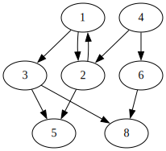

# СДП Семинар 11 -- Графи

## Основни понятия

Наредена двойка от върхове и ребра $G = (V, E)$

$V = \{v_1, v_2, v_3, \ldots, v_n\}, |V| = n$

$Е \subseteq (V \times V) \setminus \{(u, u) | u \in V\}, |E| = m$

- ориентиран и неориентиран (горната дефиниция е за ориентиран граф)
- с или без примки (горната дефиниция забранява примки)
- тегловен или не
- мултиграф
- свързаност (силна и слаба за ориентирани)
- с или без цикли

## Представяне в паметта

1. Матрица на съседство
    - `bool adjMatrix[][]`, където `adjMatrix[i][j]` показва дали има ребро между връх `i` и връх `j`
    - Използва се за представяне на гъсти графи (такива с много ребра)

2. Списък на съседство
    - Всеки връх има списък със съседите си, тоест към кои други върхове има ребра
      - `unordered_map<int, vector<int>> adjList`, `adjList[i]` - списъкът от съседите на връх `i` // За момента не знаем какво е `unordered_map`, затова просто ще ползваме `map`
    - подходящ за разредени графи (такива с малко ребра)

3. Списък на ребра
    - `vector<pair<int, int>> edges` - списък от наредени двойки, описващи ребрата между върховете
    - подходящ за проблеми, при които ребрата са осовния фокус

## Задачи

Примерен граф:

### Задача 1

Имплементирайте клас `Graph`, който представя даден ориентиран граф. Използвайте списъци на съседство и приемете, че върховете в графа са просто числа. Имплементирайте следните методи:

- `void addVertex(int vertex)` - добавя нов връх
- `void addEdge(int from, int to)` - добавя ребро между два върха
- `std::vector<int> getAdjacent(int vertex)` - връща всички върхове, към които даден връх има ребро
- `void printDot()` - отпечатва графа в `dot` формат
- `bool containsVertex(int vertex)` - проверява дали в графа се съдържа даден връх
- `bool containsEdge(int from, int to)` - проверява дали в графа се съдържа дадено ребро

### Задача 2

Имплементирайте следните методи:

- `int numberOfParents(int vertex)` - намира броя на върховете в графа, които имат ребро до `vertex`
- `bool isPath(const std::vector<int>& path)` - проверява дали `path` e път в графа. За примерния граф: `{1, 2, 5}` е път в графа, но `{1, 4, 6, 8}` не е.
- `bool pathExists(int from, int to)` - проверява дали съществува път в графа между два върха

### Зад. 3, DFS

Имплементирайте `std::vector<int> dfs(const Graph& graph)` - връща списък на върховете в графа, обходени в последователност на DFS алгоритъма

### Зад. 4, BFS

Имплементирайте `std::vector<int> bfs(const Graph& graph)` - връща списък на върховете в графа, обходени в последователност на BFS алгоритъма

### Задача 5

Реализирайте метод `bool isCyclic() const`, който проверява дали даденият граф съдържа цъкъл.
