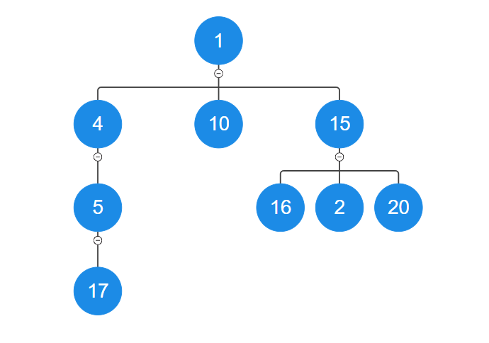
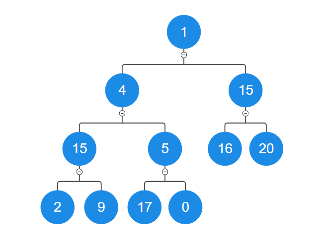
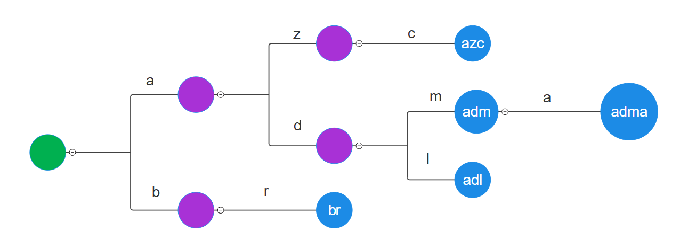

# Дървета

## Дефиниции

### Дефиниция от курса по Дискретни Структури

Нека $Т = (V, E)$ е наредената двойка от

$V$ - множество от върхове
$E$ - множество от ребра между върхове 
        $E\subset\{(u,v)∣u,v \epsilon V,u\neq v\}$

Тогава $Т$ наричаме `граф`.

Ако в $Т$ нямаме цикли, то Т e `гора`.

И допълнително ако $Т$ e гора и тя е свързана, то $Т$ е `дърво` 

---
<br>

### Друго представяне 
За нашите цели ще е по-удобно да си представяме дървото по слендият начин:

- $V$ - множеството от стойности, които ще използваме
- $Т$ - множество от възли
- $F$ - множество от списъци с възли
- $r$ - корен на дървото ($r\epsilon T$ )


Ще трябва да дефинираме следните фунции, за да можем да използваме дървото:

- Начин за изличане на информацията от възел 
**value**: T → V
<br>

- Начин за получаване на наследниците на връх 
**children**: T → F
<br>

- Начин за определяне дали връх е корен 
**isRoot** : T -> {0,1}
isRoot(t) $\leftrightarrow$ $r$ == t
<br>

- Начин за определяне дали връх е листо 
**isLeaf** : T -> {0,1} 
isLeaf(t) $\leftrightarrow$ children(t).size() == 0


## Дефиниции:

 **Празно дърво**
:  Дърво без корен

 **Съсед (Neighbor)**
: Връх, който е директно свързан с друг връх чрез ребро.

 **Родител (Parent)**
: Връх, който има изходящо ребро към друг връх (неговото дете).

 **Дете (Child)**
: Връх, който има входящо ребро от друг връх (неговият родител).

 **Sibling**
: Два върха, които имат един и същи родител.

 **Наследник (Descendant)**
: Връх, до който може да се достигне чрез повтарящо се преминаване от родител към дете.

 **Предшественик (Ancestor)**
: Връх, до който може да се достигне чрез повтарящо се преминаване от дете към родител.

 **Поддърво (Subtree)**
: Дърво, съставено от даден връх и всички негови наследници.

 **Степен на Връх (Degree)**
: Броят на децата на даден връх. Листата, по дефиниция, имат степен нула.

 **Степен на Дърво / Разклоненост (Degree of Tree)**
: Максималната степен на връх в дървото.

 **Дълбочина / Ниво (Depth/Level)**
: Броят на ребрата по уникалния път между корена и дадения връх на дървото.

 **Ширина на ниво(Width)**
: Броят на върховете на дадено ниво.

 **Размер на Дърво (Size of a Tree)**
: Общият брой на върховете в дървото.

 **Височина на дърво( Height of a Tree)**
: Mаксималната височина на връх в дървото

 **Гора (Forest)**
: Множество от едно или повече несвързани дървета.


---

*Особености на дърветата*
 - Свързан ацикличен граф
 - Рекурсивна природа на дърветата
 - Разклонена структура от данни
 - Всеки връх може да бъде достигнат по единствен път от корена
 - Корена в едно дърво е достатъчен, за да определят всички върхове в цялото дърво.

---

## Видове Дървета

#### Нерегулярни Дървета (Irregular Trees)
 - Дървета, при които степента на върховете е различна.



#### Регулярни Дървета (Regular Trees)
В тези дървета имаме фиксиранa максимална степен за всички върховете. Най-често тази степен е ниска.
- **Примери**:
  - Двоично Дърво: Всеки връх има най-много две деца.
  - Троично Дърво: Всеки връх има най-много три деца.



---


## Приложения на Дърветата
- Представяне на йерархични данни (например файлови системи).
- Ефективно търсене и сортиране (например в двоично дърво за търсене).
- Алгоритми за маршрутизация в мрежи.
- Бази данни

---

## Видове имплементация
- статичен масив от указатели във всеки връх(регулярно дърво)
- динамичен масив от указатели във всеки връх(нерегулярно дърво)
- с два указателя във всеки връх един(нерегулярно дърво)
  - един сочещ към първият си наследник
  - един сочещ към следващия брат

**Сравнение между динамичен масив и двата указателя**

**Предимства**
|Динамичен масив| Два указателя|
|-|-|
|Бързо добавяне на нов връх или поддърво в края|Бързо добавяне в началото |
|Бързо индексиране на върховете|По-малко памет|
|По-бързо обхождане поради локалност|

<br>

**Недостатъци**

|Динамичен масив| Два указателя|
|-|-|
| Повече памет | Бавно индексиране на върхове|
| Бавно вмъкване на връх между два други | По-трудно за имплементация |

---

## Алгоритми за обхождане
### DFS (Depth First Search - Обхождане в дълбочина)

**Описание:**
DFS обхожда дървото, като тръгва от корена и се движи надолу към всяко поддърво, докато достигне листо. След това се връща назад и преминава към следващия възел.

**Характеристики на DFS:**
- Най-често се имплемнтира рекурсивно
- При обхождане на дърво чрез DFS, информацията за пътя през който сме минали се пази в стека на програмата. Следователно програмата използва най-много $O(h)$ памет, където `h` e височината на дървото. Алгоритъма има сложност по време $O(n)$, където `n` е броят върхове в дървото. 


### BFS (Breadth first search - Обхождане в широчина)
**Описание:**
BFS е алгоритъм за обхождане на дървото на нива или дълбочини, т.е. първо се обхождат всички елементи с дълбочина 1, след това с дълбочина 2 и т.н. 

**Характеристики на BFS:**
- Имплементира се чрез опашка
- Тъй като върховете, които следва да бъдат обходени пазим в опашка, сложността ни по памет е от порядъка на $O(w)$, където `w` е максималния брой върхове на един слой(широчина на дървото). Всеки елемент бива обходен точно веднъж и за това получаваме сложност по време $O(n)$, където `n` e броя въхове в дървото.

---

## Имплементация на нерегулярно дърво
Нека да имплементираме нерегулярно дърво чрез динамичен масив.
Примерна структура на възел/връх:
```cpp
struct Node{
    int m_val;
    vector< Node* > m_children; 
    Node(const T& val, const vector<Node*>&  children = {}): m_val(val), m_children(children){};
};
```

Имате следният клас за дърво:

```cpp
class Tree{
    Node* m_root;

    void copy(Node*& curr,const Node* other){
        curr = new Node(other->data);
        for(int i = 0; i< other->m_children.size();i++){
            curr->m_children.push_back(nullptr);
            copy(curr->m_children[i],other->m_children[i]);
        }
    };
    void free(Node* curr){
        if(!curr)return;
        for(Node* child : curr->children )
            free(child);
        delete curr;
    };

    public:
    Tree(): m_root(nullptr){};
    Tree(const Tree& other){
        copy(m_root,other.m_root);
    }
    Tree(Tree&& other){
        swap(other.root,root);
    }
    Tree& operator=(const Tree& other){
        if(&other == this)
            return *this ;
        free(m_root);
        copy(m_root,other->m_root);
        return *this;
    }
    Tree& operator=(Tree&& other){
        swap(other.root, root);
    }

    ~Tree(){
        free(m_root);
    }
}
```

---

## Задачи за дървета
### Задача 
 Да се напишат методите:
  - print() - Принтира дървото в конзолата
  - count() - Връща броя върхове в дървото 
  - search(const T& el) - Проверява дали елемент е в дървото 
  - countOnLevel(size_t depth) - Преброява елементите на дадено ниво
  - **insertElAt**(const vector<size_t>& position, int el) - Вмъква елемент на дадена позиция. Всяко число от вектора показва в каква посока трябва да преминем.
  - insertTreeAt(const vector<size_t>& position, Tree& other) - Добавя дърво на конкретна позиция. Позицията се намира както в предишния метод. Искаме да няма споделена памет.
  - **levelSum**(size_t level) - Проверява дали числата на една и съща дълбочина са взаимно прости (НОД на числата на това ниво да бъде 1)
  

### Задача за вкъщи
Използвайки имплементация с едносвързан списък за пазене на децата реализирайте следния метод:
  - **deleteEl**(int el) - Премахва върхове, които имат стойност el. Tехните деца се качват едно ниво нагоре на мястото на изтрития елемент. Гарантирано е, че не трием корена. 

---

## Trie (Дърво на Префиксите)
- **Дефиниция**: Дървовидна структура за съхраняване на низове, при която всяко ребро представлява символ, а всеки връх представлява префикс на съхранените низове. Тъй като в нормален речник думите са с крайна дължина и са краен брой, то те могат да бъдат съхранени в краен авотмат **представен като дърво, а не граф**. Как да имплементираме такава структура?
  

#### Изисквания:
Искаме структура представяща речник от думи със сложност по памет $O(N)$, където $N = \sum_{i=0}^k n_i $, k e броя думи и $n_i, i\epsilon\{1,..,k\}$ е дължината на думата с индекс i.

Да се имплементират следните методи:




#### Характеристики:
  - Използва се за ефективно търсене на думи или префикси.
  - Всеки връх определя някакъв префикс и тогава всяко ребро излизащо от този връх определя същия префикс, но с 1 буква повече в края. 
  - Коренът на дървото представлява празния низ.
  - Листата в корена са думи в речника.
  - Думи в речника може да има и извън листата

#### Приложения:
  - Реализация на речници.
  - Автоматично довършване на текст.
  - Проверка на правопис.

---

## Задача
Имплементирайте речник чрез структурата Trie със следните методи:

- insert(const string& word) - вмъква дума в речника 
- search(const string& word) - проверява дали думата е в речника
- remove(const string& word) - изтрива дума от речника, ако съществува
- print() - принтира цялото съдържание на речника сортирано лексикографски.
