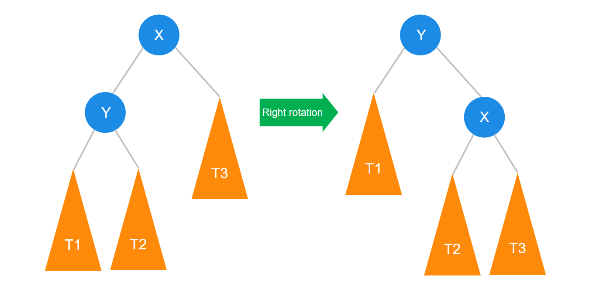
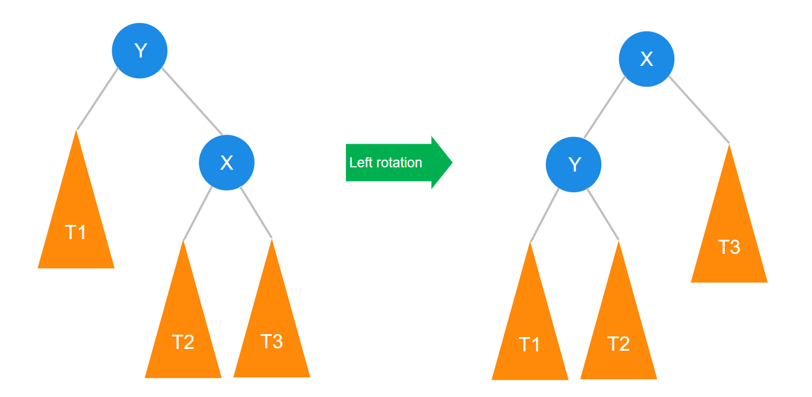
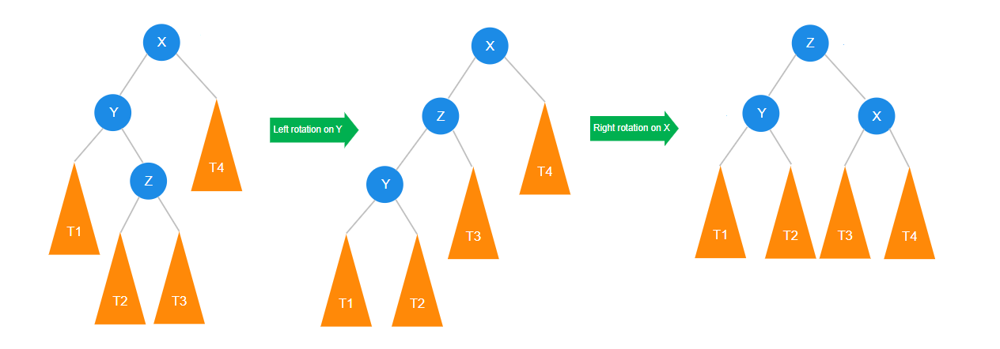
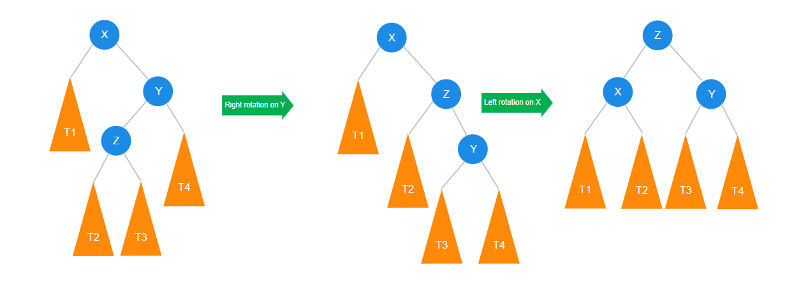
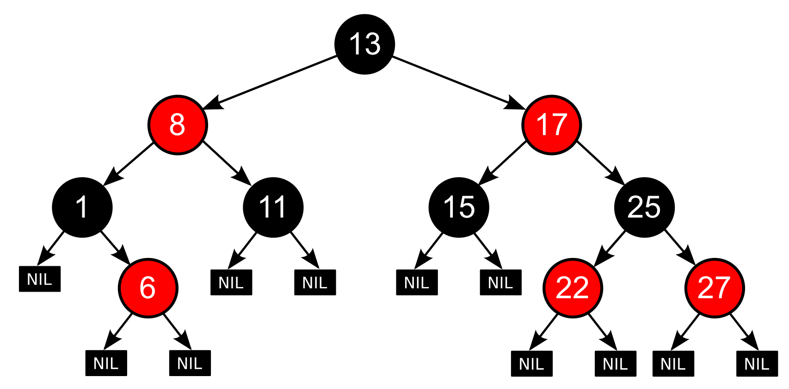
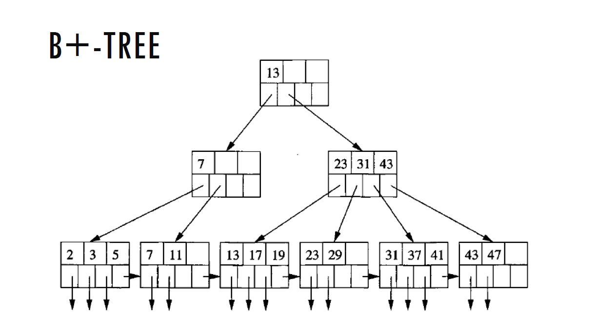

# Балансирани Двоични Дървета за Търсене

## 1. Защо са ни нужни балансирани дървета

Балансираните двоични дървета за търсене осигуряват ефективност на основните операции (търсене, добавяне, изтриване). При обикновени (небалансирани) двоични дървета за търсене височината на дървото може да стане равна на броя елементи (n) в най-лошия случай, което влошава сложността на операциите до O(n). Балансираните дървета ограничават височината до O(log n).

---

## 2. Ротации

Ротациите са операции, които използваме за възстановяване на баланса на дървото. 

### Balance factor (фактор за баланс)
Това е свойство на всеки връх. Определяме го по следния начин:

>BF(v) = height(v->left) - height(v->right)
### Видове ротации:


### 2.1. Дясна ротация 
 



   ```cpp
   void AVLTree::rightRotation(Node *& curr){
       Node* temp = curr->left;
       curr->left = temp->right;
       temp->right = curr;
       updateHeight(curr);
       curr = temp;
       updateHeight(curr);
   }
   ```
---

### 2.2. Лява ротация  



   
   ```cpp
   void AVLTree::leftRotation(Node*& curr){
       Node* temp = curr->right;
       curr->right = temp->left;
       temp->left = curr;

       updateHeight(curr);
       curr = temp;
       updateHeight(curr);
   }
   ```


---

## 3. AVL Дървета (Adelson-Velsky и Landis)

AVL дървото е вид балансирано двоично дърво за търсене, при което разликата във височината между лявото и дясното поддърво на всеки възел (Balance Factor, BF) е най-много 1.

### Баланс на дървото
Използвайки ротации в AVL дърветата постоянно поддържаме BF $\epsilon$ {-1,0,1}. Имаме 4 различни случая в които искаме да направим ротация с цел балансиране:

### Left-heavy case

<br>

### Right-heavy case


### Left-Right case


### Right-Left case


### 3.1 Имплементация
```cpp
int AVLTree::BF(Node * curr) const {
    return getHeight(curr->left) - getHeight(curr->right);
}

void AVLTree::balance(Node*& curr) {
    if(!curr)return;
    if(BF(curr) == 2) {          // Left heavy
        if(BF(curr->left) == 1)  // Left-left case
            rightRotation(curr);
        else {                   // Left-right case
            leftRotation(curr->left);
            rightRotation(curr);
        }    
    }
    else if(BF(curr) == -2) {    // Right heavy
        if(BF(curr->right) == -1)// Right-right case
            leftRotation(curr);
        else {                   // Right-left case
            rightRotation(curr->right);
            leftRotation(curr);
        }
    }
}
```

#### Помощни функции за височина
```cpp
int AVLTree::getHeight(Node * curr) const {
    if(!curr)return 0;
    return curr->height;
}

void AVLTree::updateHeight(Node* curr) {
    if(!curr)return;
    curr->height = 1 + max(getHeight(curr->left), getHeight(curr->right));
}
```

### 3.2 Анализ на AVL дърво

- **Височина на AVL дърво:**   

Знаем, че в дърво с височина h(започвайки от 1) можем да имаме най-много $2^n -1$ върха. 

Следователно 
$\log_2(n+1) \leq h \leq ?$

Знаем, че $h \leq n$, но искаме по-ниска горна граница. Питаме се колко най-малко елемента можем да имаме в дърво с височина h.

Нека фиксираме h. Тогава това дърво се състои от корена си, лявото си поддърво и дясното си поддърво.

Получаваме 

**$N(h) = N(h-1) + N(h-2) + 1$**

,където N(h) e минималния брой върхове в AVL дърво с височина h.

Очевидно N(0) = 0 и N(1) = 1.

Нека разгледаме няколко последователни стойности:

|k|N(k)|F(k)|
|:-:|:-:|:-:|
|0|0|1|
|1|1|1|
|2|2|2|
|3|4|3|
|4|7|5|
|5|12|8|
|6|20|13|
|7|33|21|

Можем да предположим следното:
$N(k) = F(k+1) - 1$

Да опитаме да го докажем по индукция по n

### **База**

$k = 0$
$N(k) = 0$
$F(k) = 1$

Твърдението е изпълнено

### **Индукционно предположение**

Нека е изпълнено за всяко i < k

### **Индукционна стъпка**

$F(k) = F(k-1) + F(k-2) + 1$

$F(k) = (f(k) - 1) + (f(k-1) - 1) + 1$

$F(k) = (f(k) + f(k-1)) - 1$

$F(k) = f(k+1) - 1$

**Твърдението е изпълнено за всяко k**

За числата на фибоначи имаме твърдение, че 

$\frac{f_{n}}{f_{n-1}} \approx 1.61803... = \varphi$

Следователно $N(h) = f(h+1) \approx \varphi^h$

Сега ако приложим логаритъм от двете страни с база $\varphi$ получаваме

$\log_{\varphi}(N(h)) \approx log_{\varphi}(\varphi^h)$

$\log_{\varphi}(N(h)) \approx h$

Чрез прилагане на $\log_{\varphi}(n)$ получаваме максималната височина на AVL дърво с n елемента 

Накрая получаваме, че 
$h(T) \leq \log_{\varphi}(n) + c$, където `T` e AVL дърво с `n` елемента, а `c` e някаква константа.

$h(T) \leq 1.440*\log_{2}(n) + c$, след като сменим базата.

#### $h\epsilon \theta(\log_2n)$

От там получаваме следните сложности:

|Операция|Сложност по време|
|-|:-:|
|Търсене в дърво|$О(\log_2 n)$|
|Добавяне на елемент|$О(\log_2 n)$|
|Премахване на елемент|$О(\log_2 n)$|
|Извличане на всички елементи в сортиран вид|$О(n)$|


---

## 4. Red-Black Дървета

Red-Black дървото е друг вид балансирано двоично дърво за търсене, което използва цветове (червен/черен) за възлите, за да гарантира балансираност. В сравнение с AVL, поддържането на баланс е по-просто, но времето за търсене може да е малко по-дълго. То се използва в библиотеки като `std::map` и `std::set` в C++.



При тях допълнително се цвета във всеки връх и поддържаме следните инварианти през цялото време:

- Всеки връх е червен или черен
- Коренът е черен
- Приемаме, че цвета на nullptr е черен
- Червен връх не може да има червени деца
- Фиксирайки произволен възел v, всеки път от v до nullptr има равен брой черни възли.


**Стратегията за добавяне на елементи е следната:**
- Добавяме червен връх със новата стойност, както при BST. 
- Възстановяваме инвариантите за дървото, чрез ротации и смяна на цвета


Добавянето става като се следва схема за всеки от 4те случая случаи.

**Стратегията за премахване на елементи е следната:**
- Премахваме дадения елемент от дървото следвайки стратегия за 3 различни случая, спрямо колко деца има дадения връх 
- Възстановяваме инвариантите за дървото, чрез ротации и смяна на цвета

При премахване в черно-червено дърво имаме 3 случая за премахване на елемента от дървото и 4 случая за възстановяване на инвариантите в дървото.
  

**Височина на черно-червено дърво**
Тъй като можем да имаме път започващ от връх v,съставен само от черни върхове, а от друга страна можем да имаме път от същия връх, при който да се редуват черни и червени върхове. По този начин можем да заключим, че за произволен връх лявото поддърво може да има най-много 2 пъти елементите на дясното поддърво и обратно. Следователно получаваме следното:

$\log_2(n+1) \leq h \leq 2*\log_2(n+1)$

#### $h\epsilon\theta(\log_2n)$

,където `h` е височината на дървото, а `n` е броят елементи в дървото

**Операции и сложности**
|Операция|Сложност по време|
|-|:-:|
|Търсене в дърво|$О(\log_2 n)$|
|Добавяне на елемент|$О(\log_2 n)$|
|Премахване на елемент|$О(\log_2 n)$|
|Извличане на всички елементи в сортиран вид|$О(n)$|

Няма да влизаме в подробности как точно става втората част от стратегията, но на който му е интересно може да разгледа следните ресурси:

[Wikipedia](https://en.wikipedia.org/wiki/Red%E2%80%93black_tree)

[Youtube](https://www.youtube.com/watch?v=qvZGUFHWChY&list=PL9xmBV_5YoZNqDI8qfOZgzbqahCUmUEin)

[Код(Github)](https://github.com/Bibeknam/algorithmtutorprograms/blob/master/data-structures/red-black-trees/RedBlackTree.cpp)

---

## 5. B-tree и B+ tree

### 5.1 Основни операции

B-tree и B+ tree са балансирани дървета, проектирани за работа с големи обеми данни и дискови операции. Разликата между тях и другите разгледани балансирани дървета е, че в B дърветата имаме по няколко елемента във връх.

### 5.2 Дефиниция на B-дърво
Нека разклонеността на дървото е m
- Всеки възел има най-много $m$ деца.
- Всеки връх освен корена и листата има поне $⌈m/2⌉$ деца .
- Корена има поне 2 деца, освен ако не е листо
- Всички лист са на една и съща дълбочина
- Вътрешните върхове имате $m-1$ ключа.
- Броя деца в един връх е броя ключове +1
- Във всеки връх ключовете се пазят в сортиран вид


### 5.3 Височина на B-дърво

#### ${ \left\lfloor \log _{d}{\frac {n+1}{2}}\right\rfloor \leq h \leq \lceil \log _{m}(n+1)\rceil -1}$
,където $d = \lceil m/2 \rceil$


### 5.4 B+ дърво


### 5.5 Дефиниция на B+ дърво
Нека разклонеността на дървото е b
- Доста подобно на B-дърво
- Вътрешните върхове вече тук се използват само като ключове(за навигация в дървото)
- Стойностите в дървото се пазят само в листата
- Листата са свързани помежду си, създавайки свързан сортиран списък от всички стойности в дървото
- В дърво с височина h можем да имаме $b^h-b^{h-1}$ елемента
- Ключовете в дървото са $b^h-1$


### Операции в B-дървета и B+ дървета
|Операция|Сложност по време|
|-|:-:|
|Търсене в дърво|$О(\log n)$|
|Добавяне на елемент|$О(\log n)$|
|Премахване на елемент|$О(\log n)$|
|Извличане на всички елементи в сортиран вид|$О(n)$|

### Разлики между B-дървета и B+ дървета
|сравнение| B-tree|b+ tree|
|-|-|-|
|Стойности|В цялото дърво|Само в листата|
|Повторения|Няма|Може да има|
|Добавяне|По-непрдвидимо и бавно| По-бързо|
|Триене|Много сложно премахване на вътрешен връх|По-просто премахване |
|Листа|Няма връзка между тях|Свързани в списък|
|Последователен достъп|Няма|Има|


### 5.5 Приложения на B-дървета

- Бази данни
- Индексиране на големи структури от данни

*Забележка: B+ дърветата са по-добри в извличането на интеравали от информация*