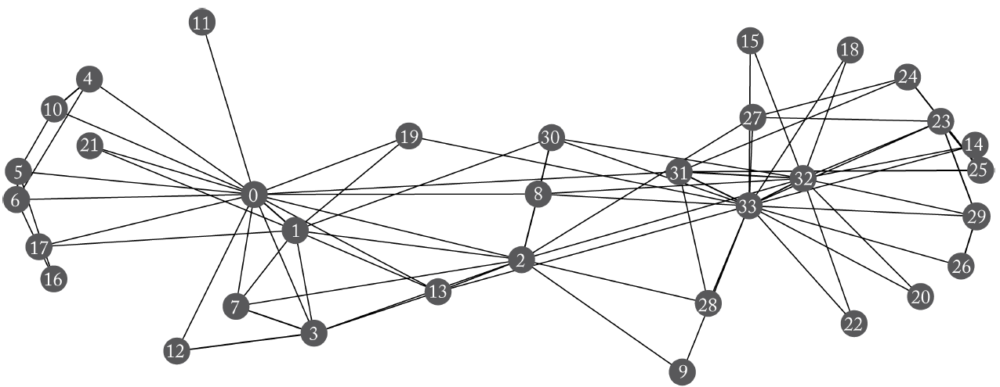
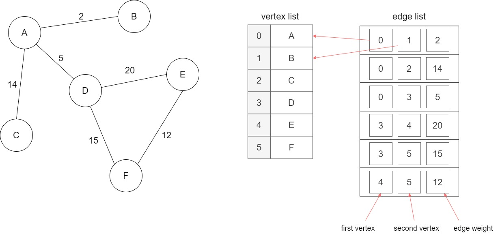
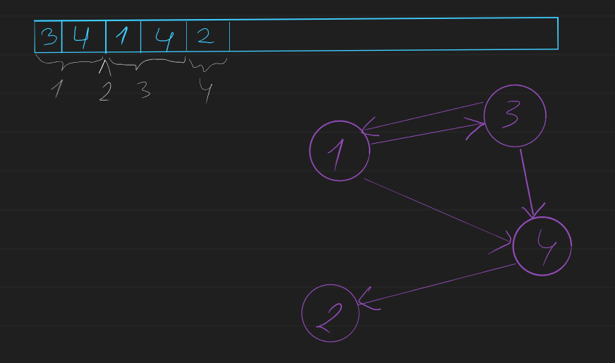
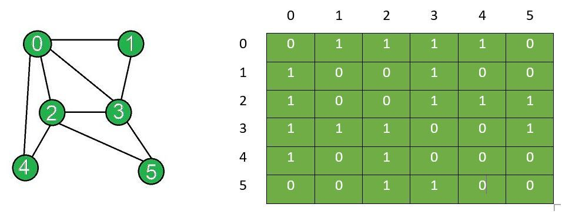
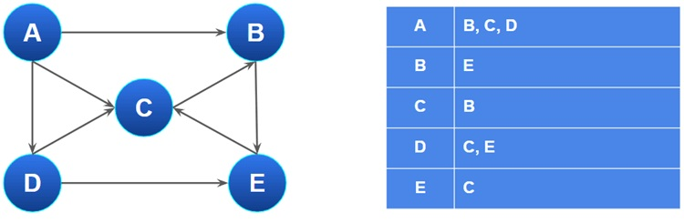
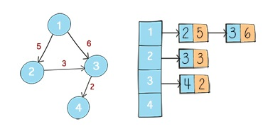

# Графи 

Графите са разклонени структури от данни представящи някакви мрежи и взаимоотношения между обекти. 

## Дефиниции

В дискретните структури имаме следната дефиниция:

Наричаме $G(V, E)$ граф, където 

$V$ - множество от върхове в графа

$Е \subseteq V \times V$ - множество от ребра

 Ориентиран граф
 : Граф, в който ребрата имате посока(E може да не е симетрична)
 
 Претеглен граф
 : Граф, в който имаме тежести по ребрата. С други думи: $\exists\omega:E \rarr \mathbb{Q}$

Свързан граф
: Съществува път между всяка двойка върхове u, v

## Операции

В абстрактната структура граф искаме да имаме следните операции:

`neighbours(u)` - връща съседите на u в графа
`add_vertex(x)` - добавя връх x към графа
`remove_vertex(x)` - премахва върха x към графа
`add_edge(x, y)` - добавя ребро от x към y към графа
`remove_edge(x)` - премахва реброто от x към y към графа
`getValue(x)` - извличане на стойността, която се пази във върха x

## Върхове в графа

За удобство ще говорим за графи, при които $V \subset \mathbb{N}$. По надолу ще видим, защо е доста удобно за върховете да си мислим като за числа. 
Ако в един граф искаме във върховете да имаме стойност различна от число, можем просто да си създадем динамичен масив, в който за всеки индекс да получаваме съответната стойност за върха. 

## Представяне на графи

След като се уговорихме за това как ще представяме върховете остава по-интересната част, а именно как да представяме ребрата в един граф. Имаме 4 основни начина на представяне на граф. Всеки има своите предимства и недостатъци. Ще ги разгледаме подробно

### Списък с ребра
Може би най-интуитивния метод са пазенето на ребрата е да ги запазваме в динамичен масив. Всяко ребро можем да представяме като наредена двойка от два върха. 

- претеглен граф
При притеглените графи можем да пазим вместо двойка, наредена тройка - два върха(краищата на реброто) и цена на реброто

### Канонично представяне 
Това представяне е доста подобно на списъка с ребра. Разликата тук е, че искаме бързо да можем да вземаме всички ребра излизащи от конкретен връх. Тук използването на числа за върхове доста помага. Ако върховете са ни числа в един масив ще запишем първо всички върхове, до които може да се стигне от първия връх. Веднага след това, върховете, до които има ребро от втория връх, и т.н. 

- претеглен граф
- Тук, когато искаме да имаме и тегла, пазим не само върхове във вектора, а наредени двойки от (съсед,тегло)

### Матрица на съседство
Матрица на съседство ще наричаме матрица с размери $|V| \times |V|$, където всяка клетка показва съществуването на ребро от върха, който се представя от съответния ред, към върха, който се представя от съответната колона. Клетката `matrix[i][j]` показва дали има връх от `i` към `j`. 

Съществуването на такъв връх бележим с 1, а липсата с 0.

- претеглен граф
Когато имаме претеглен граф при тази имплементация можем пак да използваме матрица, но този път ще пазим тежестите в клетките на матрицата. Когато някое ребро не съществува ще слагаме някаква невалидна стойност.

### Списък на съседство
Списъка на съседство има общо със матрицата на съседство, но идеята тук е че искаме да не използваме памет за ребра, които не съществуват. За тази цел създаваме n списъка/вектора с върхове. По този начин пазим в k-ия списък съседите на върха k и не пазим нищо допълнително

 

- претеглен граф
В такова представяне списъците/векторите от съседи не се състоят само от върхове, а и от тежести

 

> От всяко представяне може да се премине към всяко друго за време $O(|V|^2)$ 

### Сложности на различните представяния

|Операция|Списък ребра|Канонично представяне|Матрица на съседство|Списък на съседство|
|-|-|-|-|-|
|Съхранение(памет)| $O(\|E\|)$ |$O(\|E\|+\|V\|)$|$O(\|V\|^2)$|$O(\|E\|+\|V\|)$|
|Добавяне на връх(n+1 -ви връх )|$O(1)$|$O(\|1\|)$|$O(\|V\|)$|$O(\|1\|)$|
|Премахване на връх(произволен)|$O(\|E\|)$|$O(\|E\|)$|$O(\|E\|)$|$O(\|E\|)$|
|Добавяне на ребро|$O(1)$|$O(\|E\|)$|$O(\|1\|)$|$O(\|1\|)$|
|Премахване на ребро|$O(\|E\|)$|$O(\|E\|)$|$O(\|1\|)$|$O(\|V\|)$|
|Търсене на ребро|$O(\|E\|)$|$O(\|V\|)$|$O(\|1\|)$|$O(\|V\|)$|
|Получаване на съседите|$O(\|E\|)$|$O(\|neighbours\|)$|$O(\|V\|)$|$O(\|neighbours\|)$|

#### Обхождания на графи

## Приложения

1. Навигационни системи 
2. Компютърните мрежи(търсене, маршрутизация, потоци)
3. Социални мрежи

## Алгоритми във графи

1. DFS - Обхождане в дълбочина

2. BFS - Обхождане в широчина

3. Алгоритъм Dijkstra - търсене на най-къси пътища от даден начален

4. Алгоритъм Bellman-Ford - търсене на най-къси пътища от даден връх до всички други и откриване на отрицателни цикли

5. Алгоритъм Floyd-Warshall - търсене на най-къси пътища между всички двойки върхове в граф

6. Алгоритъм на Prim - Намиране на минимално покриващо дърво с приоритетна опашка

7. Алгоритъм на Kruskal - Намиране на минимално покриващо дърво с техниката Union-Find

8. Топологично сортиране

9. Алгоритъм на Ford-Fulkerson - Намиране на максимален поток

10. Намиране на свързани компоненти

11. Алгоритъм на Tarjan - Намиране на силно свързани компоненти 

12. Алгоритъм на Hierholzer - Намиране на Ойлеров цикъл