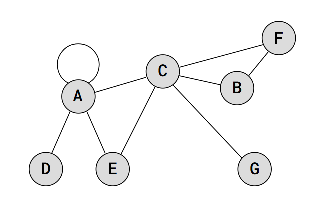

# Алгоритми върху графи 

## Обхождане на граф

### 1. DFS - Обхождане в дълбочина

Обхождането в дълбочина (DFS) е метод за обхождане или търсене на граф, който започва от даден възел и разглежда съседите максимално дълбоко, след което се връща.

#### Изисквания към графа 
 - Няма

#### Алгоритъм:
1. Започваме от начален възел.
2. Отбелязваме възела като използван
3. Рекурсивно обхождаме съседите на възела, ако не са били посетени.

### Удобни представяния
- списък на съседство 
- канонично представяне

#### Сложност:
- Времева сложност: $O(V + E)$, където V е броят на върховете, а E е броят на ръбовете.
- Пространствена сложност: O(V).

 

### 2. BFS - Обхождане в широчина

Обхождането в широчина (BFS) започва от даден възел и обхожда всички съседни върхове на текущото ниво, преди да премине към следващото ниво.

#### Изисквания към графа 
 - Няма

#### Алгоритъм:
1. Започваме от начален възел.
1. Използваме опашка, за да обхождаме възлите по нива.
2. Посещаваме всички съседни върхове на текущия възел, преди да преминем към новите нива.

### Удобни представяния
- списък на съседство 
- канонично представяне

#### Сложност:
- Времева сложност: $O(V + E)$.
- Пространствена сложност: $O(V)$.

---

## Най-къси пътища в граф

###  1. Алгоритъм Dijkstra - търсене на най-къси пътища от даден начален

Алгоритъмът на Дейкстра намира най-късите пътища от даден начален възел до всички останали върхове в графа.

#### Изисквания към графа 
 - Не може да има отрицателни цикли -> Ако е неориентиран не може да има отрицателни ребра

#### Алгоритъм:
1. Задаваме началния възел с разстояние 0 и всички останали върхове с разстояние безкрайност(INT_MAX).
2. Избераме възел с най-малко разстояние от началния и обхождаме съседите му.
3. Актуализираме разстоянията до съседните възли, ако намерим по-кратък път.

### Удобни представяния
- списък на съседство 
- канонично представяне
  
#### Сложност:
- Времева сложност: $O((V+E)logV)$, когато се използва приоритетна опашка (binary heap). $O(E+VlogV)$, когато се използва приоритетна опашка (fibonacci heap)
- Пространствена сложност: O(V).

 

### 2. Алгоритъм Bellman-Ford - търсене на най-къси пътища от даден връх до всички други и откриване на отрицателни цикли

Алгоритъмът Bellman-Ford намира най-късите пътища от един връх до всички останали и открива отрицателни цикли в графа.

#### Изисквания към графа 
- Няма

#### Алгоритъм:
1. Инициализираме разстоянията до всеки връх с безкрайност, като началения възел има разстояние 0.
2. Повтаряме за всяко ребро: ако разстоянието до текущия връх плюс цената на реброто е по-малко от текущото разтояние до края на реброто, актуализираме разстоянието.
3. Повторяме стъпка 2 V-1 пъти (където V е броят на върховете).
4. Проверка за отрицателни цикли.

### Удобни представяния
- списък на съседство 
- канонично представяне

#### Сложност:
- Времева сложност: $O(V * E)$.
- Пространствена сложност: $O(V)$.

 

### 3. Алгоритъм Floyd-Warshall - търсене на най-къси пътища между всички двойки върхове в граф

Алгоритъмът Floyd-Warshall намира най-късите пътища между всеки два върха в граф. Алгоритъмът се справя и с отрицателни тегла и цикли.

#### Изисквания към графа 
- Няма

#### Алгоритъм:
1. Инициализираме матрица на съседство, която ще използваме, за да са следим разстоянията между всеки два върха.
2. За всеки възел k, актуализираме разстоянията между всички двойки върхове i, j, като проверяваме дали пътя от i до k +  пътя от k до j е по-малък от директния път между i и j.
3. Повторяме за всеки възел k.

### Удобни представяния
- матрица на съседство

#### Сложност:
- Времева сложност: $O(V^3)$.
- Пространствена сложност: $O(V^2)$.

---

## Минимално покриващо дърво

### 1. Алгоритъм на Prim - Намиране на минимално покриващо дърво с приоритетна опашка

Алгоритъмът на Прим намира минимално покриващо дърво чрез разширяване на частично покрито дърво, като използва приоритетна опашка.

#### Изисквания към графа 
- Неориентирани графи
- Свързан граф, ако търсим покриващо дърво. 

#### Алгоритъм:
1. Започваме с произволен възел.
2. Добавяме към дървото реброто с минимално тегло, което е свързано с текущото покрито дърво, използвайки приоритетна опашка.
3. Добавяме всички съседи на новия връх към приоритетната опашка, ако все още не са в покритото дърво.

### Удобни представяния
- списък на съседство 
- канонично представяне

#### Сложност:
- Времева сложност: $O((V+E)logV)$, когато се използва приоритетна опашка (binary heap). $O(E+VlogV)$, когато се използва приоритетна опашка (fibonacci heap)
- Пространствена сложност: $O(V+E)$.

 

### 2. Алгоритъм на Kruskal - Намиране на минимално покриващо дърво с техниката Union-Find

Алгоритъмът на Крускал намира минимално покриващо дърво чрез сортиране на ръбовете и използване на Union-Find за свързване на компоненти.

#### Изисквания към графа 
- Неориентирани графи
- Свързан граф, ако търсим покриващо дърво. 

#### Алгоритъм:
1. Избираме ребрата в сортиран ред. 
2. Ако реброто, което е наред не образува цикъл, го вземаме.  
3. Използваме Union-Find за свързване на двете компоненти, които се намират в двата края на реброто

### Удобни представяния
- списък с ребра 
- канонично представяне

#### Сложност:
- Времева сложност: $O(E log E)$ или $O(E log V)$.
- Пространствена сложност: $O(V + E)$.

---

## Топологично сортиране

Алгоритъмът за топологично сортиране се използва за подреждане на върховете в даден граф, така че за всеки път от u до v, възел u да се постави преди v.

#### Изисквания към графа 
- Ориентиран граф
- Да няма цикли

#### Алгоритъм:
1. Изчисляваме входящата степен за всеки възел.
2. Използваме опашка, за да обработим възлите с нулева входяща степен.
3. Добавяме съседите на възлите с нулева входяща степен в опашката след като и тяхната входяща степен е станала 0.

### Удобни представяния
- списък на съседство 
- канонично представяне

#### Сложност:
- Времева сложност: $O(V + E)$.
- Пространствена сложност: $O(V)$.
