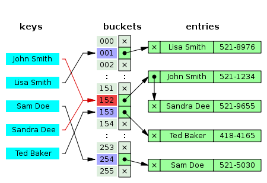
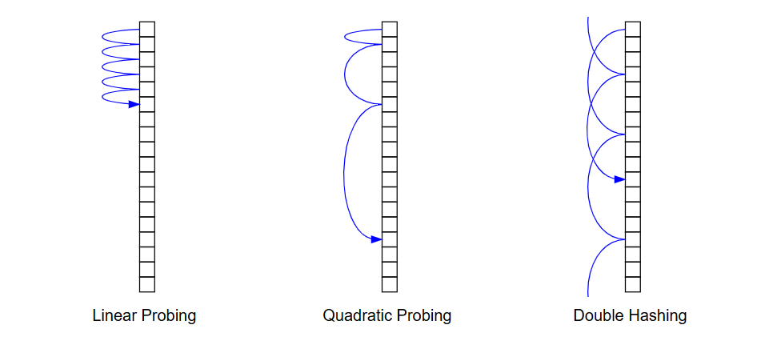
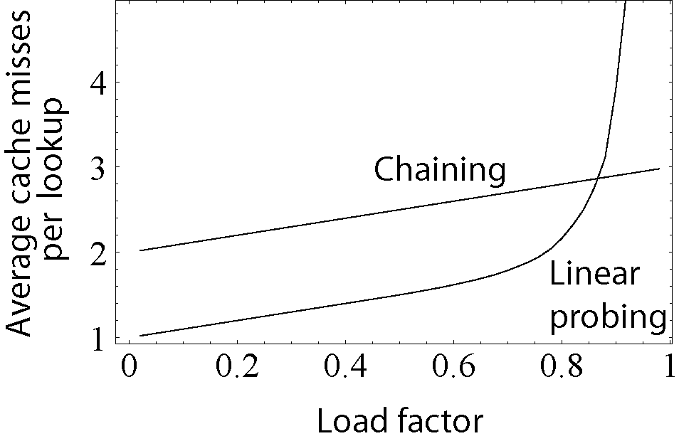

# Хештаблици

Хештаблиците са структури представящи речници или множества. Те могат да са линейни или разклонени. Най-важното за тях е, че ни дават много бързи достъп до елементите и промяна на елементите. 

## Речник
Какво ще наричаме речник? 
Нека имаме **множество от ключове(уникални)** - $K$, **множество от стойности** - $V$, и частична функция $f:K \rightarrow V$. Тогава ще наричаме $f$, речник на двойките ключ-стойност $(k,v)\epsilon f, k \epsilon K, v \epsilon V$.

## Операции в речник
- find - Намира елемент в речника
- insert - Добавя елемент в речника
- remove - Премахва елемент от речника

## Масив от двойки
Ако в масив пазим наредените двойки (ключ,стойност), отново получаваме речник и то без ограничения на множеството K. Минусът на този подход е, че за достъп до конкретен ключ, трябва да правим линейно търсене, което за големи обеми от данни е доста неефктивно.

Тук нямаме наредба на ключовете.

### Операции
|Операция|Сложност|
|:-|:-:|
|find| $O(n)$|
|insert| $O(1)$|
|remove| $O(n)$|

## Масив и индекси за ключове
Без структури от данни можем да имплементираме прост речник, но с доста ограничения. Този речник ще бъде представен от масив, но това ни дава доста ограничения за множеството $K$. В такива случаи $\exists N :  K = [0,N-1] \cap \mathbb{Z}$

Тъй като ключовете са ограничени по-този начин получаваме и подредба на ключовете в тази имплементация.

### Операции
|Операция|Сложност|
|:-|:-:|
|find| $O(1)$|
|insert| $O(1)$|
|remove| $O(1)$|

## Пример - дни от седмицата 
Искаме да направим речник, който по подадено число от 1 до 7 да връща съответния ден от седмицата. Можем ли да го направим, така че да подаваме деня и да ни връща номера.

## Речник с дървета
Използвайки балансирани двоични наредени дървета, можем да постигнем по-добър речник. В този случай имаме само едно ограничени за множеството от ключове и то е, че ключовете трябва да са сравними. 
При тази имплементация ключовете се поддържат в сортиран ред, затова получаваме и наредба

### Операции
|Операция|Сложност|
|:-|:-:|
|find| $O(n)$|
|insert| $O(1)$|
|remove| $O(n)$|

## Хеш таблици
Хеш таблиците се опитват да достигнат сложността на имплементацията с масив и индекси за ключове, но премахвайки ограниченията за ключовете. При хеш таблиците не можем да премахнем абсолютно всички ограничения, но остава само ограничението да можем да съпоставим на всеки ключ някакво число в някакъв интервал. По този начин директно използваме метода с масива, но ни е нужна допълнителна стъпка.

## Хеш функция
Хеш функция ще наричаме точно това съответсвие между ключовете и индекси. Целта ни е да измислим тотална функция, която за даден ключ от конкретен тип изчислява число(индекс).

Това число, което бива изчислено наричаме **хеш** на някакъв ключ.

За всеки тип могат да се измислят много видове хеш функции, но това не ги прави добри. Казваме, че хеш функция е добра, когато разпределя индексите получени от ключовете възможно най-равномерно из множеството на индексите.

Казваме, че хеш функция е перфеткна, когато е инективна, т.е. няма колизии.

Защо ни е нужно това? 

## Колизии
Тъй като много често се случва така че множеството на ключовете е с по-голяма мощност от множеството на индекси. По принципа на Дирихле получаваме, че ще съществува индекс, който да може да се получава от два различни ключа. Такива ситуации наричаме колизии.

 *Не е задължително ключовете да са повече от индексите. Колизии могат да се случат и когато ключовете са по-малко от индексите.*

## Справяне с колизии 
Имаме много подходи, чрез които се справяме с колизии, но в общия случай се разделят на два вида: **затворена**(chaining) и **отворена** адресация.

## Затворена адресация
Един доста интуитивен подход би бил, когато имаме колизия да пазим и двата ключа в контейнер. В такъв случай ако колизиите са малко ще можем бързо да намиране ключовете, защото в отделните контейнер няма да има много елементи.

Този подход се нарича separate chaining и в повечето случаи се използва едносвързан списък или динамичен масив.

При този подход разчитаме на това, че хеширащата функция е добра, в противен случай ще ни се наложи да правим линейно търсене върху не малък брой елементи, което ще бъде бавно.

### Операции
|Операция|Сложност в общия случай|Сложност в лошия случай|
|:-|:-:|:-:|
|find| $O(1)$|$O(n)$|
|insert| $O(1)$|$O(1)$|
|remove| $O(1)$|$O(n)$|

### Оптимизация с дървета
Ако добавим допълнително ограничение, към ключовете, а именно да бъдат сравними, можем да смъкнем горната граница в лошия случай. Ако вместо едносвързани списъци използваме самобалансиращи се дървета във всеки bucket. Получаваме следните сложности: 

### Операции
|Операция|Сложност в общия случай|Сложност в лошия случай|
|:-|:-:|:-:|
|find| $O(1)$|$O(log(n))$|
|insert| $O(1)$|$O(log(n))$|
|remove| $O(1)$|$O(log(n))$|

## Отворена адресация
Един минус на горната имплементация е, че може да се случи така, че в таблицата да има много елементи и въпреки това много от bucket-ите да не бъдат използвани.

Подходът, който се опитва да се справи с този проблем е отворената адресация. При отворената адресация ако получим колизия, вместо да добавяме елементите с еднакъв хеш в bucket, просто го добавяме на друго място в таблицата. Имаме няколко начина за определяне къде точно да се постави елемент ако получим колизия. Най-популярните са следните:

 - Линейно пробване(Linear Probing)
 - Квадратично пробване(Quadratic Probing)
 - Двойно хеширане(Double hashing)

### Операции
|Операция|Сложност в общия случай|Сложност в лошия случай|
|:-|:-:|:-:|
|find| $O(1)$|$O(n)$|
|insert| $O(1)$|$O(n)$|
|remove| $O(1)$|$O(n)$|

 

## Load factor
Load factor е основна величина на хеш таблиците, която ни показва *"колко е натоварена таблицата"*. Изчисляваме го по следния начин:

$loadFactor = \frac{брой стойности в таблицата}{капацитет на таблицата}$

*Какво означава таблицата да има loadFactor > 1?*

### Разлика между подходите 
 

## Преоразмеряване на таблицата

### Затворена адресация
При затворената адресация не е нужно таблицата да се преоразмерява, но в такъв случай елементите във всеки bucket ще започнат да стават много. Затова е хубаво таблицата да може да се преоразмерява. При този подход е показано, че преоразмеряването на таблицата е най-добре да се случва когато loadFactor-a е в интервала [1,3]. Естествено както при динамичния масив, искаме да преоразмеряваме таблицата с фактор от 2, за да получим сложност от амортизирана константа. 

### Отворена адресация
Тук преоразмеряването е много важно и необходимо, тъй като ако loadFactor-а стигне 1, няма да има повече места в таблицата. Затова тези таблици е задължително да имат механизъм за преоразмеряване освен ако не се знае предварително, колко ще са ключовете. За тези таблици се препоръчва преоразмеряване, когато loadFactor-а е в интервала [0.6, 0.75].  

Какво се случва с елементите при преоразмеряване?

Не е добре елементите да се оставят в първата половина на таблицата, защото получаваме струпване на елементите в началото. Затова е хубаво да разместим елементите, така че да са развномерно разпределени в новата таблица. За тази цел можем да хешираме всички елементи наново използвайки новата хеш функция и така получаваме отново равномерно разпределение на елементите. 

## Сравнение между отворена и затворена адресация

|Подход|Техники срещу колизии|loadFactor за преоразмеряване|Предимства|
|:-:|:-:|:-:|:-:|
|Отворена адресация|линейна проба, квадратична проба, двойно хеширане и много други| 0,6 - 0,75 | Не използва допълнителна памет, Локалност, по-добра работа ако ключовете се знаят предварително |
|Затворена адресация|chaining с едносвързан списък или вектор, използване на самобалнсиращо се дърво в bucket-ите| 1 - 3 | по-лесно премахване, няма проблем със струпване|

## Структури в C++ използващи хеш таблици
- std::unordered_map - речник
- std::unordered_set - множество от елементи
- std::unordered_multimap - речник с повторения на ключове
- std::unordered_multiset - мултимножество

