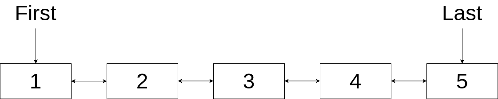
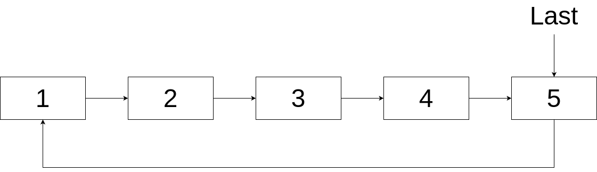
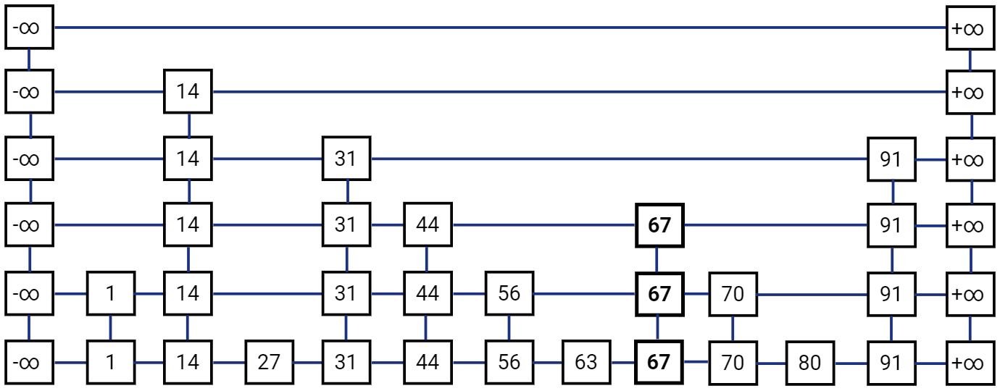

# Седмица 06 - Други видове списъци

## Линеен двусвързан списък
Линейния двусвързан списък е вид свързан списък, при който елементите знаят както кой е следващият, така и кой е предишният елемент във веригата. За целта, елементите на този вид списъци представляват наредени тройки от стойността на елемента и два указателя - съответно към следващия и предишния елемент. Стандартно, тези тройки могат да се реализират по следния начин:

```c++
struct Node {
  T data;
  Node *prev, *next;

  Node(const T& data, Node* const prev = nullptr, Node* const next = nullptr)
    : data(data), prev(prev), next(next) {}
};
```

Подобно на линейния едносвързан списък, за реализацията на линейния двусвързан списък можем да използваме два указателя - един към първия и един към последния елемент във веригата. Предимствата на двусвързания списък са, че операциите по добавяне на елемент в края на списъка, добавяне на елемент преди дадена позиция и премахването на елемент от или преди дадена позиция имат времева сложност от O(1) както и, че можем ефективно да реализираме итератор за обхождане в обратен ред. Недостатъците са, че управлението на вътрешното представяне на веригата става по-сложно, понеже трябва да менежираме два указателя. Освен това двусвързания списък заема повече памет, поради допълнителния указател, който трябва да пазим с всеки елемент. Ето една примерна организация на елементите в линеен двусвързан списък:



## Цикличен едносвързан списък
Цикличният едносвързан списък е свързан списък, при който последният елемент от веригата е свързан с първия, образувайки своеобразен цикъл (веригата се затваря). За целта е достатъчно да представим елементите като наредена двойка от стойността и следващия елемент във веригата, подобно на линейния едносвързан списък, но за разлика от него не е нужно да пазим указатели към началото и края на веригата, а е достатъчно да пазим указател само към края. Тогава добавянето на елемент в края на списъка има сложност по време от O(1) и понеже последният елемент е свързан с първия, то добавянето на елемент в началото също има сложност по време от O(1), понеже можем просто да добавим елемента след последния. Операцията по премахване на първия елемент също има сложност по време от O(1), но премахването на последния елемент продължава да има сложност по време от O(n), поради това, че трябва да пренасочим предпоследния елемент към първия. Недостатъците на цикличния едносвързан списък, спрямо линейния, са, че трябва да бъдем по-внимателни с това накъде насочваме указателите на елементите във веригата и да внимаваме да не зациклим при неговото обхождане. Едни от най-честите приложения на този вид списъци е когато искаме да циклим през някакви елементи без прекъсване, като например да редуваме ходовете на играчи в онлайн игри или да пускаме музикални плейлисти от начало, както и за симулиране на диспечери на задачи. Ето една примерна организация на елементите в цикличен едносвързан списък:



Естествено можем да реализираме и цикличен двусвързан списък, като при него използваме идеята от линейния двусвързан сисък за свързване на елементите както със следващия, така и с предишния елемент от веригата. Тогава печелим сложност по време на операцията за премахване на последния елемент от O(1), но управлението на вътрешното представяне става доста по-сложно.

## Списък с прескачане
Списъкът с прескачане (Skip list) е базиран на идеята за свързан списък, като също така взаимства идеята за поддържане на наредба на елементите. За разлика от другите списъци, които разглеждахме до сега, той не е линеен - вместо това той е разделен на нива, като всяко ниво представлява отделен линеен едносвързан списък. Списъкът с прескачане е структура от данни, която е базирана на вероятности - при добавянето на елемент към списъка има вероятност той да бъде "промотиран" към по-горно ниво. Както споменахме, той поддържа наредба на елементите, т.е. елементите в списъка са сортирани. Това, плюс разделянето на нива, ни гарантира амортизирана времева сложност на операциите по добавяне, премахвване и търсене от O(log n). 

Структурата на елементите в списъка с прескачане е следната: при добавяне на елемент започваме да гледаме най-високото ниво (т.е. това е нивото, до което е най-вероятно да са достигнали най-малко елементи) и започваме да търсим елемент по-голям от текущия. Когато достигнем такъв, слизаме на следващото ниво и повтаряме това, докато не слезем на най-ниското ниво, където вече добавяме елемента на правилното му място спрямо наредбата на елементите. След това има шанс елементът да бъде промотиран на по-високо ниво - в такъв случай, той ще бъде добавен на правилното му място, спрямо наредбата, на всички нива до това, до което е промотиран. Така се получава, че горните нива са "експресни линии", чрез които можем да прескочим голяма част от елементите до достигане на правилното място (откъдето и името на структурата). Операциите по търсене и премахване се основават на същия принцип на движение по нивата. Ето една примерна организация на елементите в списък с прескачане:



Понеже един елемент може да бъде на няколко нива, то това означава, че той може да има много указатели към следващи елементи, спрямо различните нива. Тогава структурата на елементите става следната:

```c++
struct Node {
  T data;
  std::vector<Node*> forward;

  Node(const T& data, std::size_t level = 0) 
    : data(data), forward(level + 1, nullptr) {}
};
```

Списъкът с прескачане е една от доста разпространените структури от данни, която намира приложение в различни области. Често се използва при реализацията на индекси за бази данни, на по-сложни конкурентни структури, на диспечер на процесите в операционните системи и много други.

## Задача 01 - Линеен двусвързан списък
Напишете шаблон на линеен двусвързан списък, който съдържа следните базови методи:

- bool empty() const - проверява дали списъкът е празен;
- std::size_t get_size() const - достъпва броя на елементите в списъка;
- void insert_first(const T& data) - добавя елемент в началото на списъка;
- void insert_last(const T& data) - добавя елемент в края на списъка;
- void remove_first() - премахва елемента в началото на списъка;
- void remove_last() - премахва елемента в края на списъка;
- поддържане на основните операции за работа с итератор.

За списъка напишете итератор, който обхожда елементите спрямо техния ред в структурата. Освен това итераторът трябва да може да обхожда елементите в обратен ред.

Към реализацията на списъка добавете и следните методи:

- void insert_after(const T& data, const Iterator& position) - добавя елемент след дадената позиция;
- void insert_before(const T& data, const Iterator& position) - добавя елемент преди дадената позиция;
- void remove_after(const Iterator& position) - премахва елемента след дадената позиция;
- void remove_before(const Iterator& position) - премахва елемента преди дадената позиция;
- void remove_at(const Iterator& position) - премахва елемента на дадената позиция.
- void append(const DoublyLinkedList& other) - "закача" два списъка, като се запазва реда на елементите;
- void reverse() - обръща реда на елементите в списъка;
- bool is_palyndrome() const - проверява дали списъкът е палиндром, т.е. ако прочетем елементите от ляво надясно, те са същите като да ги прочетем от дясно наляво.

## Задача 02 - Опашка с два края
Напишете шаблон на опашка с два края, която съдържа следните методи:

- void enqueue_front(const T& data) - добавя елемент в началото на опашката;
- void enqueue_back(const T& data) - добавя елемент в края на опашката;
- T dequeue_front() - премахва първия елемент в опашката и връща неговата стойност;
- T dequeue_back() - премахва последния елемент в опашката и връща неговата стойност;
- const T& front() const - връща стойността на първия елемент в опашката без да го премахва;
- const T& back() const - връща стойността на последния елемент в опашката без да го премахва;
- bool empty() const - проверява дали опашката е празна.

Всеки от тези методи трябва да работи с времева сложност от O(1).

С помощта на опашката с два края, решете следната задача:

Даден е масив с дължина `n` и естествено число `k`. Изведете максималния елемент за всеки подмасив с дължина `k`.

### Пример:
| Вход | Изход |
| :----- | :------ |
| 10 <br /> 8 5 10 7 9 4 15 12 90 13 <br /> 4 | 10 10 10 10 15 15 90 90 |

## Задача 03 - Цикличен едносвързан списък
Напишете шаблон на цикличен едносвързан списък, който съдържа следните методи:

- bool empty() const - проверява дали списъкът е празен;
- std::size_t get_size() const - достъпва броя на елементите в списъка;
- void insert_first(const T& data) - добавя елемент в началото на списъка;
- void insert_last(const T& data) - добавя елемент в края на списъка;
- void remove_first() - премахва елемента в началото на списъка;
- void remove_last() - премахва елемента в края на списъка;
- void advance_first() - премества първия елемент в списъка на следващата позиция;
- const T& first() const - връща стойността на първия елемент в списъка.

С помощта на цикличния списък решете проблема на `Josephus`: дадени са 2 естествени числа `n` и `k` и след това имената на `n` играчи, които са наредени в кръг. Започваме да се движим по кръга и елиминираме всеки `k`-ти играч, докато не остане само един. Вашата задача е да изведете името на последния останал играч в кръга.

### Пример:
| Вход | Изход |
| :----- | :------ |
| 7 3 <br /> Gosho Pesho Tosho Ivan Dragan Petkan Asen | Ivan |

## Задача 04* - Списък с прескачане
Напишете шаблон на списък с прескачане, който съдържа следните методи:

- void insert(const T& data) - добавя нов елемент в списъка;
- bool search(const T& data) - проверява дали елемент се съдържа в списъка;
- void remove(const T& data) - премахва даден елемент от списъка, ако той се съдържа в него.
- поддържане на основните операции за работа с итератор.

Добавянето на елемент трябва да има 50% шанс да промотира елемента към следващото ниво. За списъка напишете итератор, който обхожда елементите спрямо техния ред в структурата.