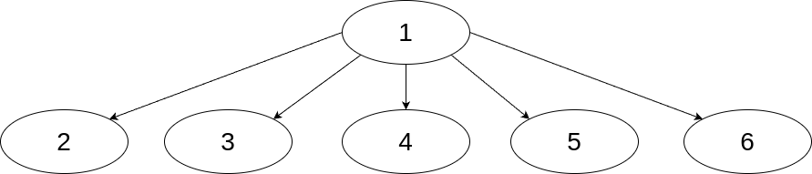

# Седмица 07 - Дървета

## Дефиниция на дърво
Математическата дефиниция на дърво е следната: дърво наричаме всеки свързан ацикличен граф. Така изказана обаче, тази дефиниция трудно може да се транслира към структурите от данни, затова можем да въведем следната еквивалентна дефиниция:

- кортеж от 0 елементи е дърво, което в частност наричаме празното дърво;
- ако T<sub>1</sub>, ... , T<sub>n</sub> са дървета и X е някаква стойност, то кортежът (X, T<sub>1</sub>, ... , T<sub>n</sub>) е дърво с корен X и наследници T<sub>1</sub>, ... , T<sub>n</sub>.

Когато говорим за структурата от данни дърво, ще използваме именно горната индуктивна дефиниция. От нея вече лесно става ясно, че дървото не е линейна структура от данни, като стека, опашката и видовете списъци, които разгледахме. Подобни структури, при които елементите са свързани на база на връзки от типа родител-дете, се наричат йерархични структури от данни. Това са едни от най-употребяваните структури от данни, понеже чрез тях можем много лесно да моделираме елементи от реалния свят, които имат подобна йерархична структура, като например родствени връзки, различни видове таксономии, състояния с преходи към следващите възможни и др.

Дефиницията, която дадохме за дървета обаче е твърде обща и не налага достатъчно ограничения, от които да можем да получим някакви полезни свойства на дърветата. Затова има различни видове дървета, които разширяват тази дефиниция, като част от тях ще разгледам в това и следващите упражнения.

## Дървета с произволен брой наследници
Дърветата с произволен брой наследници са най-чистия вид на дървета, при които не се налагат никакви допълнителни ограничения над горната дефиниция. Въпреки това, те са полезни в случаите като искаме да моделираме елементи от реалния свят, за които знаем, че имаме йерархична структура, но нямаме допълнителна информация как изглежда конкретно тази структура, като например файлова система. Отделните върхове ще представяме чрез следната структура:

```c++
template <typename T>
struct TreeNode {
  T data;
  std::vector<TreeNode<T>*> children;

  TreeNode(const T& data, const std::vector<TreeNode<T>*>& children = std::vector<TreeNode<T>*>())
   : data(data), children(children) {}
};
```

В случая, `data` представлява самата стойност във върха, а `children` са поддърветата, които са наследници на текущия връх. Тогава можем да представим дървото с произволен брой наследници като указател към корена на дървото, понеже от него можем да достигнем до всеки друг връх на дървото.

Алтернативно можем да реализираме дърво с произволен брой наследници и без да използваме горната структура. Вместо това, можем да представим дървото чрез стойността в корена и масив от дървета, представляващ поддърветата на текущото. По този начин избягваме нуждата да менежираме ръчно указателите за върховете.

Ето едно примерно дърво с произволен брой наследници:


Проблемите на този вид дървета са, че те могат да се изродят до списъци, ако не добавяме елементите по правилен начин. Ако например добавяме всеки следващ елемент като нов наследник на първото поддърво на корена, то тогава всички елементи, освен корена, са на едно ниво и на практика получаваме линейна структура.

Ето едно примерно изродено дърво:




**Важно**: това е абстрактен модел на дърво с произволен брой наследници. В практиката едва ли ще реализирате дървото по този начин - най-вероятно ще имате повече данни по върховете и структурата ще се получи по-скоро естествено и няма да се наложи да правите отделна структура за неговто представяне.

## Двоични дървета
Двоичните дървета са дървета, които имат най-много 2 наследника на всеки връх. Това ограничение върху броя на наследниците ни помага да изведем някои полезни свойства на дървото, както и да правим по-лесен анализ на структурата му. Ще представяме върховете чрез следната структура:

```c++
template <typename T>
struct TreeNode {
  T data;
  TreeNode<T> *left, *right;

  TreeNode(const T& data, TreeNode<T>* const left = nullptr, TreeNode<T>* const right = nullptr)
   : data(data), left(left), right(right) {}
};
```

В случая, `data` представлява самата стойност във върха, а `left` и `right` са указатели към съответно лявото и дясното поддърво, излизащо от върха. Отново, можем да представим двоичното дърво като указател към корена на дървото. Това е свързано представяне на двоично дърво, но можем да направим и последователно представяне. За целта можем да използваме масив, като първата стойност в него да е стойността в корена, а за всеки от останалите върхове, ако i е индекса на родителя, то стойностите в корените на лявото и дясното поддърво ще бъдат на позиции 2\*i + 1 и 2\*i + 2. От една страна обаче тази имплементация не е толкова интуитивна, а от друга при нея може да има много излишества ако дървото не е построено добре. За сега обаче няма да се фокусираме върху тази имплементация.

При двоичните дървета не можем да използваме същата идея за реализация без структурата `TreeNode`, както успяхме да го направим при дърветата с неограничен брой наследници, понеже тогава няма да можем да представим дърво, което няма ляв наследник, но има десен.

Ето едно примерно двоично дърво:


Въпреки ограничението на броя наследници, все още може двоичното дърво да се изроди до списък. Това може да стане като винаги, когато добавяме елемент, да го добавяме като ляво поддърво на най-лявото поддърво (аналогично и за дясното). За да се справим с този проблем можем да наложим допълнителни ограничения за балансираност, но това ще разгледам по-напред в курса.

Ето едно примерно изродено дърво:


## Задача 01 - Дърво с произволен брой наследници
Напишете шаблон на клас `Tree`, представляващ дърво с произволен брой наследници. За класа добавете следните методи:

- void add_subtree(const Tree& subtree) - добавя ново поддърво към корена на текущото дърво;
- const T& root() const - връща стойността в корена на дървото;
- bool empty() const - проверява дали дървото е празно;
- void dfs() const - обхожда дървото по метода на търсене в дълбочина;
- void bfs() const - обхожда дървото по метода на търсене в ширина;
- bool contains(const T& data) const - проверява дали даден елемент се среща като връх в дървото.

## Задача 02 - Двоично дърво
Напишете шаблон на клас `BinaryTree`, представляващ двоично дърво. За класа добавете следните методи:

- BinaryTree(const T& data, BinaryTree&& left = BinaryTree(), BinaryTree&& right = BinaryTree()) - конструктор, приемащ стойността в корена, както и лявото и дясното поддърво, излизащи от корена;
- const T& root() const - връща стойността в корена на дървото;
- bool empty() const - проверява дали дървото е празно;
- bool contains(const T& data) const - проверява дали даден елемент се среща като връх в дървото;
- bool operator==(const BinaryTree& other) const - проверява дали две двоични дървета съдържат еднакви елементи.
- std::size_t height() const - връща височината на дървото;
- std::vector\<T> level(std::size_t index) const - връща масив от стойностите във всички върхове от дадено ниво в дървото; 
- BinaryTree\<U> map(const std::function<U(const T&)>& f) const - връща ново дърво, което е получено от оригиналното, чрез прилагането на подадената функция над всяка от стойностите във върховете.

## Задача 03 - Итератор
За класа `BinaryTree` напишете итератор, който обхожда елементите спрямо стратегията "ляво-корен-дясно". Добавете необходимите методи за работа с итератор в класа `BinaryTree`.