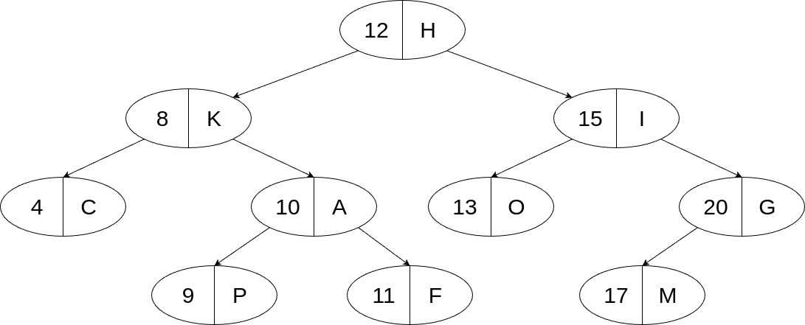

# Седмица 08 - Двоично дърво за търсене

## Какво е двоично дърво за търсене
Двоичното дърво за търсене (Binary Search Tree, BST) е двоично дърво, над което са наложени следните ограничения:

- стойността в корена на дървото, трябва да е по-голяма или равна от стойностите във всички възли на лявото му поддърво;
- стойността в корена на дървото, трябва да е по-малка или равна от стойностите във всички възли на дясното му поддърво;
- горните две условия трябва да са изпълнени за всяко поддърво.

В случая под "по-голяма" и "по-малка" стойност се има предвид спрямо някаква линейна наредба (т.е. не е задължително стойностите да са числа). Най-често, ние ще представяме стойностите във възлите като наредени двойки от ключ и стойност. Ключът ще ни е нужен, за да можем да определим наредбата на елементите, а стойността ще бъде конкретната стойност която искаме да запазим в дървото. По този начин можем да съхраняваме произволни елементи в дървото, дори такива, които не поддържат линейна наредба. Възлите на двоичното дърво за търсене ще представяме чрез следната структура:

```c++
template <typename K, typename V> 
struct TreeNode {
  K key;
  V value;
  TreeNode<K, V> *left, *right;

  TreeNode(const K &key, const V &value, TreeNode<K, V> *const left = nullptr,
           TreeNode<K, V> *const rigth = nullptr)
      : key(key), value(value), left(left), right(right) {}
};
```

В нея, `key` е ключът, определящ наредбата, `value` е самата стойност, а `left` и `right` са съответно лявото и дясното поддървета, излизащи от дадения връх.

Ето едно примерно двоично дърво за търсене:



## Операции върху двоично дърво за търсене
Основните операции, които всяко едно двоично дърво за търсене поддържа, са търсене на елемент, добавяне на елемент и премахване на елемент. Всяка една от тези операции трябва да намери мястото на елемента в дървото. Чрез наложените ограничения за наредба, когато търсим това място и сме стигнали до някой конкретен възел, ние знаем със сигурност в кое поддърво се намира елемента - ако елемента има по-малък ключ от този на елемента във възела, то е в лявото поддърво, а иначе - в дясното. Така значително намаляваме броя на обходените възли в дървото. По конкретно, ако `h` е височината на дървото, то всяка една от горните 3 операции има сложност по време `O(h)`, докато при обикновеното двоично дърво, те имат сложност `O(V)`, където `V` е броят на възлите в дървото. 

## Проблеми при двоичните дървета за търсене
При двоичните дървета за търсене може да се наблюдава същия проблем, както и при обикновените двоични дървета, а именно дървото да се изроди до списък. Това може да се получи, ако, започвайки от празното дърво, на всяка стъпка добавяме по-малък елемент от всички останали елементи в дървото. Тогава новите елементи, винаги ще се закачат като най-леви листа на дървото и то ще се изроди до списък. В този случай **h = V**, т.е. в лошия случай, двоичното дърво за търсене и обикновеното двоично дърво нямат разлика във времевата сложност на операциите си. Ако обаче дървото бива конструирано така, че височината му да е най-малка, то **h = log<sub>2</sub>(V + 1)**. Тогава времевата сложност на операциите става логаритмична, което е сериозно подобрение, спрямо обикновените двоични дървета. За да можем обаче да си гарантираме, че височината на дървото ще е винаги оптимална, трябва да наложим допълнителни ограничения за балансираност на дървото, с които ще се занимаваме по-подробно следващия път.

## Задача 
Напишете шаблон на клас `BinarySearchTree`, представляващ двоично дърво за търсене. За класа добавете следните методи:

- std::optional\<V> search(const K& key) const - намира стойността на елемент, спрямо неговия ключ;
- void insert(const K& key, const V& value) - добавя елемент в дървото. Ако елементът се съдържа в дървото, стойността му да се промени на подадената стойност;
- void remove(const K& key) - премахва елемент от дървото спрямо неговия ключ;
- bool is_balanced() const - проверява дали дървото е балансирано;
- V kth_element(std::size_t k) const - намира стойността на k-тия елемент в дървото спрямо наредбата на ключовете;
- void merge(const BinarySearchTree& other) - слива две двоични наредени дървета. Функцията трябва да има времева сложност от `O(V1 + V2)`, където V1 е броят върхове на първото дърво, а V2 - броят върхове на второто. Полученото дърво трябва да има възможно най-малка височина;
- void remove_leaves(const K& from, const K& to) - премахва всички листа от дървото, които не са с ключове по-големи от `from` и по-малки от `to`.

За класа `BinarySearchTree` напишете итератор, който обхожда елементите спрямо тяхната наредба. Добавете необходимите методи за работа с итератор в класа.