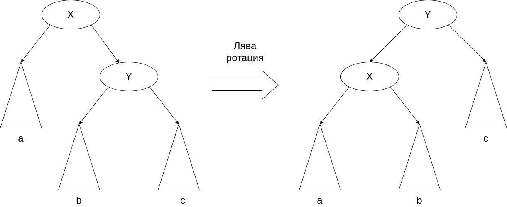
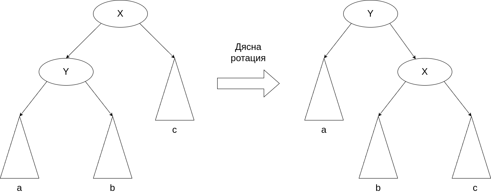

# Седмица 09 - Балансирани дървета

## Нуждата от балансирани дървета
В предните семинари вече видяхме какви са проблемите на двоичните дървета и двоичните дървета за търсене, а именно, че те могат да се изродят до списък. За да можем да се справим с този проблем, трябва да наложим допълнителни ограничения над тях - това ще са ограниченията за баланс. Вече казахме, че едно дърво е балансирано, когато абсолютната разлика на височините на двете поддървета на кой да е връх е най-много 1. Когато едно дърво е балансирано, височината му е равна на log<sub>2</sub>(V + 1), където V е броят на възлите в дървото. Тогава в случая, когато дървото е двоично дърво за търсене, операциите по търсене, добавяне и премахване имат времева сложност от log<sub>2</sub>(V). 

## AVL дървета
AVL дърветата (Adelson-Velsky Landis trees) са вид самобалансиращи се двоични дървета за търсене. Те са самобалансиращи, защото след всяка една операция по добавяне и премахване, ако балансът на дървото е нарушен, то извършва операции, които да възвърнат баланса. За да може проверката за балансираност да е бърза, всеки връх пази колко е височината на поддървото с корен този връх. Тогава структурата, с която представяме възлите би изглеждала така:

```c++
template <typename K, typename V>
struct TreeNode {
  K key;
  V value;
  TreeNode* left;
  TreeNode* right;
  std::size_t height;

  TreeNode(const K& key, const V& value) : key(key), value(value), left(nullptr), right(nullptr), height(1) {}
};
```

Проверката за балансираност се свежда до проверка на т.нар. балансиращ фактор на възлите. Балансиращият фактор на даден възел е разликата от височините на лявото и дясното му поддървета. Ако балансиращия фактор е по-малък от -1, то дясното поддърво е по-високо и такъв възел казваме, че е по-тежък от дясно. Аналогично, ако балансиращият фактор е по-голям от 1 казваме, че възелът е по-тежък от ляво. Конкретната стойност на балансиращия фактор не е важна, важно е само в кой интервал попада. Това позволява операциите по пресмятането и обновяването му да имат константна сложност по време.

Чрез балансиращия фактор можем много лесно да разберем дали дървото е балансирано или не. Ако балансът е нарушен, то се изпълняват поредица от операции, наречени ротации, над всеки от върховете от добавения/премахнатия до корена на дървото. Тяхната идея е така да се промени структурата на дървото, че едновременно да се запази наредбата на върховете и да се възвърне баланса на дървото. Те трябва да са бързи операции, понеже в лошия случай те ще бъдат изпълнени за всеки връх от корена до някое листо, т.е. log<sub>2</sub>(V) пъти след всяка промяна по дървото.

## Видове ротации
Основните видове ротации са лява и дясна ротация. 

Лявата ротация изглежда така:



Дясната ротация изглежда така:



Както се вижда, дясната ротация е обратна на лявата. При AVL дърветата се прилагат и още 2 ротации, които са комбинации на горните две - лява-дясна и дясна-лява. При лява-дясна ротация първо се прави лява ротация на лявото поддърво и след това се прави дясна ротация на цялото дърво. При дясна-лява е наобратно - първо се прави дясна ротация на дясното поддърво и след това лява на цялото дърво. 

Тези общо 4 вида ротации покриват всички случаи на нарушен баланс в AVL дърво:

- лявата ротация се използва, когато възелът е по-тежък от дясно и дясното поддърво на десния му наследник е по-високо от лявото;
- дясната ротация се използва, когато възелът е по-тежък от ляво и лявото поддърво на левия му наследник е по-високо от дясното;
- дясна-лява ротация се използва, когато възелът е по-тежък от дясно и лявото поддърво на десния му наследник е по-високо от дясното;
- лява-дясна ротация се използва, когато възелът е по-тежък от ляво и дясното поддърво на левия му наследник е по-високо от лявото;

## Други видове балансирани дървета
Освен AVL дървета има още много други видове балансирани дървета. Някои по-известни от тях са червно-черните дървета, изкривени дървета, B и B+ дървета и др.

- Червено-черните дървета си приличат с AVL дърветата по това, че използват същите ротации за постигане на баланс, но се различават по това, че не използват балансиращ фактор за откриване на дисбаланс, а използват допълнителен бит във всеки връх, определящ "цвета" му - дали е черен или червен. При тях има наложени строги правила за реда и цветовете на върховете, чрез които може лесно да се открият нарушения в баланса. Балансирането не е перфектно, както е при AVL дърветата, но е достатъчно, за да осигури логаритмична сложност по време на операциите;
- Изкривените дървета са самобалансиращи се дървета, които обаче не гарантират, че височината им ще е минимална. Вместо това те приличат на кеш - по-скоро достъпените елементи могат да бъдат достъпени отново по-бързо. Това гарантира амортизирана логаритмична сложност по време на операциите, като в някои случаи тя е дори по-добра;
- B и B+ дърветата са по-генерализиран вариант на двоичните дървета за търсене, поради това, че техните възли могат да имат повече от 2 наследника. Най-често те се използват за постоянни структури от данни (persistent data structures) - това са структури от данни във файловата система, които съхраняват данните на диска. Това ги прави едни от най-използваните структури в релационните бази от данни.

## Задача
Напишете шаблон на клас `AVLTree`, представляващ AVL дърво. За класа добавете следните методи:

- std::optional\<V> search(const K& key) const - намира стойността на елемент, спрямо неговия ключ;
- void insert(const K& key, const V& value) - добавя елемент в дървото. Ако елементът се съдържа в дървото, стойността му да се промени на подадената стойност;
- void remove(const K& key) - премахва елемент от дървото спрямо неговия ключ;
- void pretty_print() const - принтира дървото, така че структурата му да бъде лесно видима. Имате свобода за формата на принтиране;
- const V& closest_value(const K& key) const - намира стойността в този възел от дървото, който има най-близката стойност на ключа до `key`;
- const V& lowest_common_ancestor(const K& key1, const K& key2) const - намира стойността във върха, който е най-близкия общ родител на върховете с ключове `key1` и `key2`;
- R accumulate(const K& low, const K& high, const std::function\<R(const V&, const R&)>& accumulator, const R& null_value) const - натрупва резултата от прилагането на функцията `accumulator` над всички елементи в дървото с ключ по-голя от `low` и по-малък от `high`;
- std::pair\<AVLTree\<K, V>, AVLTree\<K, V>> split(const K& key) const - разделя дървото на две дървета, като първото съдържа възлите с ключове по-малки от `key`, а второто съдържа възлите с ключове по-големи от `key`. Помислете дали може да използвате някой от предните методи за реализирането на този.

За класа `AVLTree` напишете итератор, който обхожда елементите спрямо тяхната наредба. Добавете необходимите методи за работа с итератор в класа.
